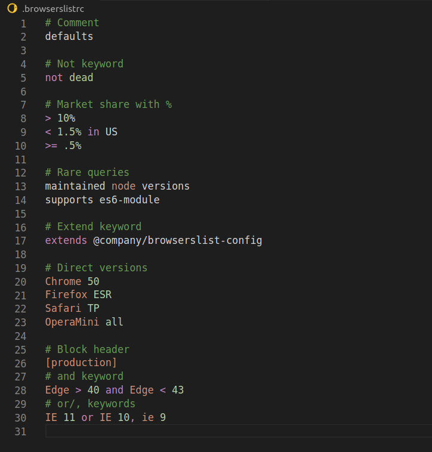
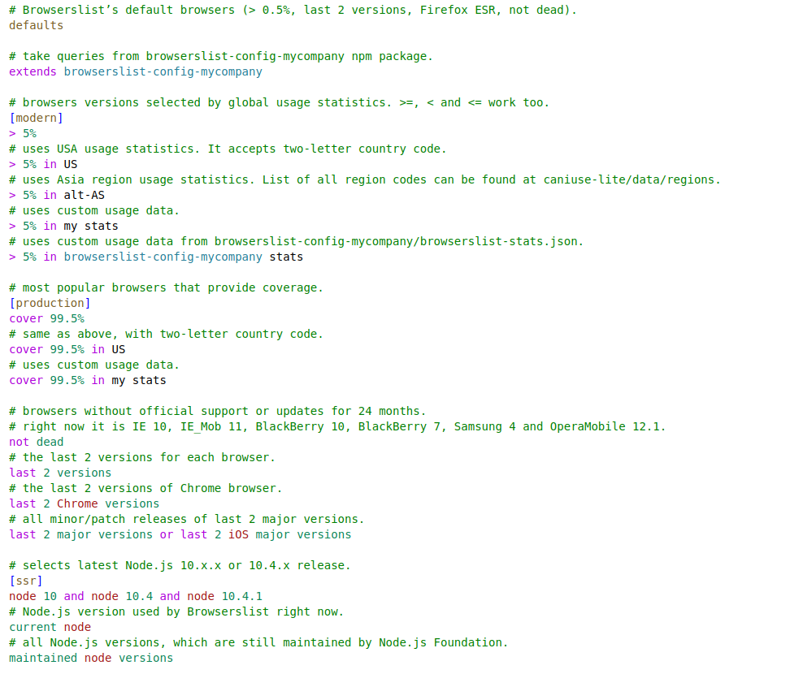

# Browserslist syntax highlight for Visual Studio Code

Syntax highlight [extension](https://marketplace.visualstudio.com/items?itemName=webben.browserslist) for [Browserslist](https://github.com/browserslist/browserslist) config, `browserslistrc`.

## Examples

